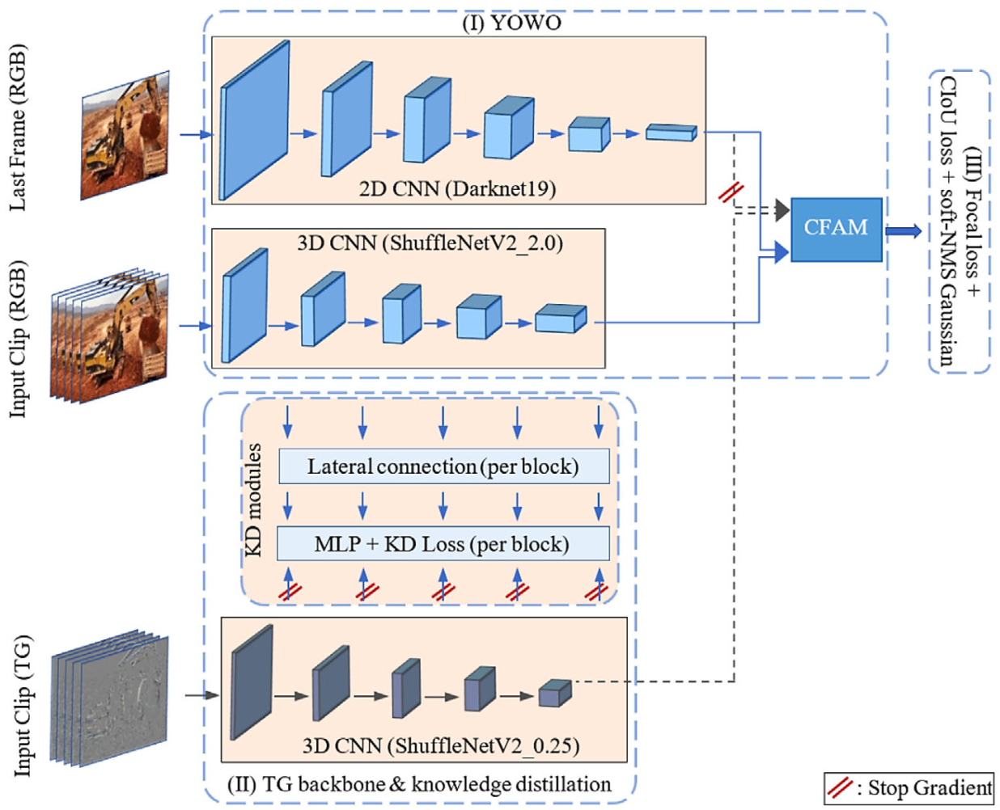

# DIGER: Improving Single-Stage Activity Recognition

This repository contains a reference implementation of the core components of the DIGER framework.

DIGER (*DI*-stillation of temporal *G*radient data for construction *E*ntity activity *R*ecognition) is a method designed to enhance the YOWO (You Only Watch Once) single-stage activity recognition model. It addresses a key limitation of these models: low per-frame accuracy, which often requires slow and computationally expensive post-processing steps.

By significantly improving per-frame performance, DIGER largely eliminates the need for this post-processing, making it highly effective for real-time monitoring applications.



## Key Features & Contributions

The improved performance of DIGER is achieved through three main contributions:

1.  **Knowledge Distillation of Temporal Gradient (TG) Data:** An auxiliary "teacher" backbone learns rich motion features from TG data (the pixel-wise difference between consecutive frames). This knowledge is then distilled into the primary RGB "student" model during the training phase.

2.  **Real-Time Performance:** The auxiliary TG backbone and knowledge distillation process are used **only during training**. The TG backbone is discarded for inference, meaning DIGER achieves significantly higher accuracy than the base YOWO model with **no extra computational cost** at runtime.

3.  **Improved Localization Accuracy:** The framework integrates **Complete Intersection over Union (CIoU) Loss** for more robust and precise bounding box regression, improving object localization.

## Repository Content

This repository includes the primary components for the DIGER training and inference pipeline.

**Please Note:**
* The dataset used for training and evaluation in the paper is not included in this repository.

For a comprehensive understanding of the framework, evaluation, and results, please refer to the [full paper](https://doi.org/10.1111/mice.13157).

## Citation

If you find this work or code useful for your research, please consider citing our paper:

```bibtex
@article{ghelmani2024improving,
  title={Improving single-stage activity recognition of excavators using knowledge distillation of temporal gradient data},
  author={Ghelmani, Ali and Hammad, Amin},
  journal={Computer-Aided Civil and Infrastructure Engineering},
  pages={1--26},
  year={2024},
  publisher={Wiley Periodicals LLC},
  doi={10.1111/mice.13157}
}
